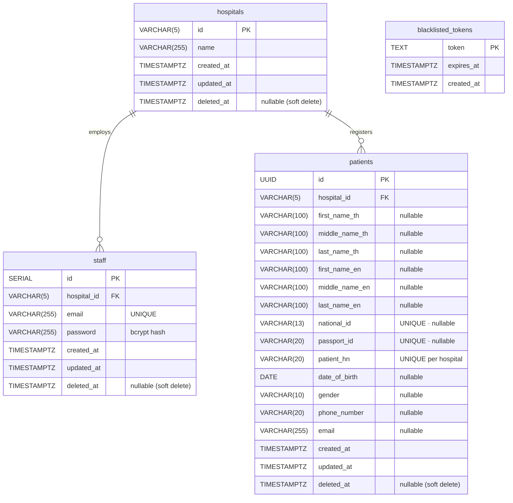

# 🏗️ Project Structure — `pt_search_hos`

> **Architecture:** Ports & Adapters (Hexagonal)
> **Module:** `pt_search_hos` · **Go:** 1.25

---

## 📁 Directory Tree

```
pt_search_hos/
│
├── cmd/                            # Entry points
│   ├── fiber/
│   │   └── main.go                 # Run Fiber server:  go run ./cmd/fiber/
│   └── main.go                     # (legacy / reference)
│
├── domain/                         # 🔵 Core — no external dependencies
│   ├── errors.go                   # Sentinel errors (ErrInvalidInput, ErrNotFound …)
│   ├── staff.go                    # Staff, Hospital, StaffRepository, StaffService interfaces
│   └── patient.go                  # Patient, PatientSearchInput, PatientRepository, PatientService interfaces
│
├── repository/                     # 🟢 Driven adapter — PostgreSQL / GORM
│   ├── model.go                    # GORM models (DB ↔ domain mapping)
│   ├── staff_repo.go               # Implements domain.StaffRepository
│   └── patient_repo.go             # Implements domain.PatientRepository
│
├── services/                       # 🟡 Use-case layer
│   ├── staff_service.go            # Implements domain.StaffService
│   ├── staff_service_test.go       # Unit tests — 24 cases
│   ├── patient_service.go          # Implements domain.PatientService
│   ├── patient_service_test.go     # Unit tests — 13 cases
│   └── service_test_summary.md     # 📋 Test summary (37 total)
│
├── middleware/                     # 🔴 Driving adapters — HTTP middleware
│   ├── fiber/
│   │   ├── auth.go                 # JWT validation (package fibermiddleware)
│   │   └── ratelimit.go            # Rate limiting: 10/min auth, 100/min API
│   └── gin/
│       ├── auth.go                 # JWT validation (package ginmiddleware)
│       └── ratelimit.go            # Rate limiting via golang.org/x/time/rate
│
├── handler/                        # 🔴 Driving adapters — HTTP handlers
│   ├── fiber/                      # package fiberhandler
│   │   ├── health.go               # GET /hello
│   │   ├── staff.go                # POST /staff/login · /staff/create · GET /staff/hello · /staff/logout
│   │   ├── patient.go              # GET /patient/search/:id · POST /patient/search
│   │   ├── router.go               # SetupRoutes()
│   │   ├── staff_test.go           # Handler tests — Staff (17 cases)
│   │   └── patient_test.go         # Handler tests — Patient (12 cases)
│   └── gin/                        # package ginhandler
│       ├── health.go               # GET /hello
│       ├── staff.go                # POST /staff/login · /staff/create · GET /staff/hello · /staff/logout
│       ├── patient.go              # GET /patient/search/:id · POST /patient/search
│       ├── router.go               # SetupRoutes()
│       ├── staff_test.go           # Handler tests — Staff (17 cases)
│       ├── staff_test_summary.md   # 📋 Staff handler test summary
│       ├── patient_test.go         # Handler tests — Patient (12 cases)
│       └── patient_test_summary.md # 📋 Patient handler test summary
│
├── config/
│   └── config.go                   # Loads .env (AppPort, DBHost, DBPort …)
│
├── docker-compose.yml              # PostgreSQL container
├── database_schema_er.sql          # DDL — table definitions
├── database_setup.sql              # DB init script
├── database_insert.sql             # Seed data (hospitals + sample patients)
├── database_test.sql               # Test queries
│
├── openapi.yaml                    # OpenAPI 3 spec
├── api_spec.md                     # API documentation (markdown)
│
├── go.mod                          # Module: pt_search_hos
├── go.sum
└── .env                            # DB credentials, JWT secret, port (not committed)
```

---

## 🧩 Architecture Layers

```
┌─────────────────────────────────────────────────────┐
│              HTTP Clients / curl / frontend          │
└────────────────────────┬────────────────────────────┘
                         │
┌────────────────────────▼────────────────────────────┐
│         🔴  Driving Adapters  (handler/)             │
│                                                      │
│   handler/fiber/   (GoFiber + fibermiddleware)       │
│   handler/gin/     (Gin     + ginmiddleware)         │
└────────────────────────┬────────────────────────────┘
                         │  domain interfaces
┌────────────────────────▼────────────────────────────┐
│         🟡  Use-Case / Services  (services/)         │
│                                                      │
│   StaffService    — login · create · logout          │
│   PatientService  — getByID · getByCondition         │
└────────────────────────┬────────────────────────────┘
                         │  domain interfaces
┌────────────────────────▼────────────────────────────┐
│         🟢  Driven Adapters  (repository/)           │
│                                                      │
│   StaffRepository    — GORM / PostgreSQL             │
│   PatientRepository  — GORM / PostgreSQL             │
└─────────────────────────────────────────────────────┘
```

---

## 🗄️ Entity Relationship Diagram



> **Constraints**
> - `patients.chk_patient_name` — at least one of (TH name pair) **or** (EN name pair) must be set
> - `patients.chk_patient_identity` — `national_id` **or** `passport_id` must be non-null
> - `patients.uq_patient_hn` — `(hospital_id, patient_hn)` unique together
> - `blacklisted_tokens` is standalone — no FK to `staff` (tokens are self-describing JWTs)

---

## 🌐 API Routes

| Method | Path | Auth | Description |
|--------|------|------|-------------|
| `GET` | `/hello` | ❌ | Health check |
| `POST` | `/staff/login` | ❌ | Login → JWT |
| `POST` | `/staff/create` | ❌ | Register staff → JWT |
| `GET` | `/staff/hello` | ✅ JWT | Authenticated hello |
| `GET` | `/staff/logout` | ✅ JWT | Blacklist token |
| `GET` | `/patient/search/:id` | ✅ JWT | Search by national/passport ID |
| `POST` | `/patient/search` | ✅ JWT | Search by condition (name, DOB …) |

> Rate limits: `POST /staff/*` → 10 req/min · all other authenticated routes → 100 req/min

---

## 🔑 Domain Interfaces (Ports)

### StaffRepository
| Method | Description |
|--------|-------------|
| `FindByEmail(email)` | Lookup staff by email |
| `Create(staff)` | Insert new staff record |
| `FindHospitalByName(name)` | Lookup hospital |
| `AddBlacklistedToken(token, exp)` | Persist logout token |
| `LoadBlacklistedTokens()` | Load all active blacklist |

### StaffService
| Method | Description |
|--------|-------------|
| `Login(email, password)` | Validate credentials → JWT |
| `CreateStaff(email, password, hospital)` | Create staff → JWT |
| `Logout(token)` | Blacklist token in DB + memory |
| `IsTokenBlacklisted(token)` | In-memory check |
| `LoadBlacklist()` | Sync DB → memory on startup |

### PatientRepository
| Method | Description |
|--------|-------------|
| `FindByID(id, hospitalID)` | Search by national/passport ID |
| `FindByCondition(input, hospitalID)` | Multi-field search |

### PatientService
| Method | Description |
|--------|-------------|
| `GetPatientByID(id, hospitalID)` | Lookup single patient |
| `GetPatientByCondition(input, hospitalID)` | Multi-condition search |

---

## 📦 Key Dependencies

| Package | Version | Purpose |
|---------|---------|---------|
| `github.com/gofiber/fiber/v2` | v2.52 | Fiber HTTP framework |
| `github.com/gin-gonic/gin` | v1.12 | Gin HTTP framework |
| `gorm.io/gorm` + `gorm.io/driver/postgres` | v1.31 | ORM + PostgreSQL driver |
| `github.com/golang-jwt/jwt/v5` | v5.3 | JWT sign / parse |
| `golang.org/x/crypto` | v0.48 | bcrypt password hashing |
| `golang.org/x/time/rate` | v0.14 | Token-bucket rate limiting (Gin) |
| `github.com/stretchr/testify` | v1.11 | Test assertions + mocking |
| `github.com/joho/godotenv` | v1.5 | `.env` loader |

---

## 🧪 Test Coverage

| Package | Tests | Coverage |
|---------|-------|----------|
| `services/` | 37 | ~100% |
| `handler/fiber/` | 29 | ~100% |
| `handler/gin/` | 29 | ~100% |

```bash
# Run all tests
go test ./...

# With coverage report
go test ./... -coverprofile=coverage.out
go tool cover -html=coverage.out -o coverage.html
```

---

## 🚀 Running the Server

```bash
# Prerequisites
cp .env.example .env          # fill in DB credentials + JWT_SECRET
docker-compose up -d          # start PostgreSQL

# Run Fiber adapter (default)
go run ./cmd/fiber/

# Run Gin adapter
go run ./cmd/gin/             # (when cmd/gin/ is present)
```
